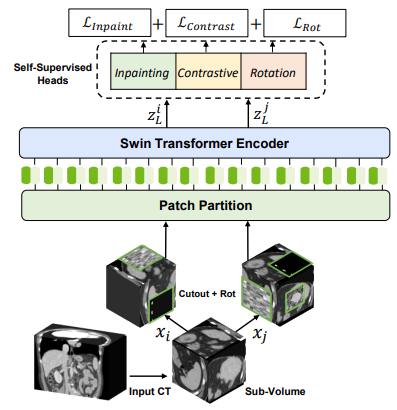
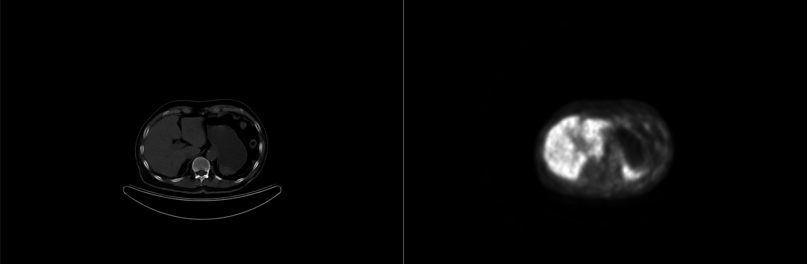

# SwinUNETR-Pretraining on CT/PET Medical Images
This repo is a fork of the pretraining phase of SwinUNETR which is a self-supervised framework for medial image analysis. You can find the repository [here](https://github.com/Project-MONAI/research-contributions/tree/main/SwinUNETR/Pretrain). 

## Framework Overview
SwinUNETR is self-supervised learning framework for 3D medical image analysis which uses a Swin Transformer encoder and a CNN decoder. The framework leverages three pretext tasks for pre-training on CT images: masked volume inpainting, contrastive learning, and rotation prediction, which aim to capture the anatomical patterns and contextual information of the human body. The framework is validated by fine-tuning the pre-trained Swin UNETR on two public benchmarks of MSD and BTCV for 3D medical image segmentation, and achieves state-of-the-art results on both datasets. The architecture of Swin UNETR is illustrated below:

For self-supervised pre-training, randomly cropped tokens are augmented with different transforms such as rotation and cutout and used for pre-text tasks such as masked volume inpainting and contrastive learning and rotation. An overview of the pre-training framework is presented
in the following:

## Data
Our dataset comprises full-body CT/PET 3D images from patients diagnosed with prostate cancer, utilized to train a semantic segmentation model aimed at enhancing the detection and treatment planning of the disease. The dataset includes 3D PET images, consisting of 2D slices measuring $168 \times 168$ pixels, with a voxel size of $4.07 \times 4.07 \times 3$ millimeters. For CT images, each slice dimensions are $512 \times 512$ pixels, with a voxel size of $0.97 \times 0.97 \times 3$ millimeters. The total number of slices per 3D image varies depending on the patient's height and the imaging modality, encompassing an area from the skull to the mid-thighs. Below is an illustration featuring two slices from a representative CT/PET 3D image:

<figure>
  
  <figcaption style="text-align: center;">An example slice of CT (left) and PET (right) images.</figcaption>
</figure>

Both image modalities are captured using the same device; however, patient movements between the two imaging steps can prevent the slices from being perfectly aligned. To process the images from both modalities together as a 4D tensor, it is crucial that they have an equal number of slices that are exactly aligned with each other. This alignment is not naturally present due to potential patient movements. Therefore, image registration techniques are employed to ensure precise alignment, enabling the combined use of both modalities in the model. CT images undergo downsampling to match the dimensions of PET images. Subsequently, pixel values of each modality are clipped and normalized to fall within the range of 0 to 1.

Our dataset consists of two categories: labeled and unlabeled data. Due to the high cost and extensive time required for labeling at this scale, we possess only 45 labeled 3D images. As the processes of training and data curation were conducted simultaneously, we have acquired two sets of unlabeled data (one with 450 and the other with 760 samples), enabling us to analyze the impact of dataset size on the performance of framework.

Each labeled dataset includes a $168 \times 168$ segmentation mask. Overall, there are 12 distinct classes labeled: 10 are organs (Lacrimal glands, Parotid glands, Submandibular glands, Tubarial glands, Sublingual gland, Kidneys, Spleen, Liver, Small intestine, and Bladder), one represents lesions, and one denotes the background.

## Experiments and Results
To be written...

## References
[1]: Tang, Y., Yang, D., Li, W., Roth, H.R., Landman, B., Xu, D., Nath, V. and Hatamizadeh, A., 2022. Self-supervised pre-training of swin transformers for 3d medical image analysis. In Proceedings of the IEEE/CVF Conference on Computer Vision and Pattern Recognition (pp. 20730-20740).

[2]: Hatamizadeh, A., Nath, V., Tang, Y., Yang, D., Roth, H. and Xu, D., 2022. Swin UNETR: Swin Transformers for Semantic Segmentation of Brain Tumors in MRI Images. arXiv preprint arXiv:2201.01266.
